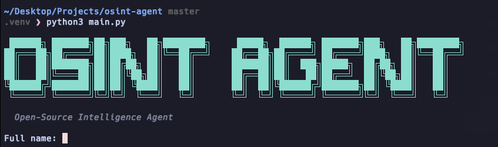

# OSINT Agent



LLM-driven CLI tool for open-source intelligence gathering. Give it a name, email, or social handle and it autonomously investigates across public sources, producing a structured Markdown report.

## How it works

The agent loops through registered OSINT tools — the LLM decides which tool to call next, cross-references findings, and produces a final report including identity summary, online presence, breach exposure, associated accounts, and a risk assessment.

**Tools:**
- `search_username` — scans 300+ social platforms via Sherlock
- `harvest_info` — gathers emails, subdomains, names via theHarvester
- `check_email_registration` — checks service registrations via Holehe
- `search_web` — DuckDuckGo web search
- `fetch_url` — extracts readable text from any page
- `check_email_breaches` — Have I Been Pwned breach lookup

## Install

```bash
git clone https://github.com/KailashGanesh/OSINT-Agent.git
cd OSINT-Agent
bash setup.sh
```

## Usage

```bash
source .venv/bin/activate
# edit .env with your API key
python3 main.py --name "John Doe" --location "New York"
python3 main.py --email user@example.com --socials "@handle1,@handle2"
python3 main.py --name "Jane" --location "London" --save report.md --verbose
```

```
Options:
  --name       Full name of the person
  --age        Approximate age
  --location   City or country
  --socials    Known social handles (comma-separated)
  --email      Known email address
  --phone      Known phone number
  --verbose    Show detailed tool call output
  --save PATH  Save report to file (default: report.md)
  --model      Model to use
```

## Configuration

Set `LLM_API_KEY` in `.env`. Two providers supported:

**OpenCode (default):**
```env
LLM_API_KEY=your-key-here
# LLM_MODEL=deepseek-v4-pro
# LLM_BASE_URL=https://opencode.ai/zen/go/v1
```

**OpenAI:**
```env
LLM_API_KEY=sk-your-key-here
LLM_MODEL=gpt-5.4
LLM_BASE_URL=https://api.openai.com/v1
```

Optional: `HIBP_API_KEY` for breach checks (free at haveibeenpwned.com/API/Key).

## Requirements

- Python 3.10+ (theHarvester needs 3.12+)
- Sherlock, Holehe, theHarvester (auto-installed by setup.sh)
